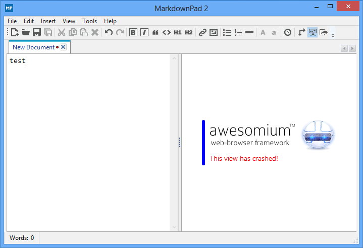

# MarkDown  入门

> Markdown是一种简单的、轻量级的标记语法.创始人为约翰·格鲁伯（John Gruber）.它允许人们使用易读易写的纯文本格式编写文档,然后转换成有效的XHTML(或者HTML)文档.    ----来自维基百科

它用简洁的语法代替排版,而不像一般我们用的字处理软件Word等有大量的排版、字体设置.软件大多是所见即所得的模式,方便使用.它是为那些需要经常码字或者进行文字排版的、对码字手速和排版顺畅度有要求的人群设计的.用户可以使用诸如 * # 等简单的标记符号以最小的输入代价生成极富表现力的文档.

适用人群:需要写文档的码农、博客写手、网站小编、出版业人士等等

> <p style="color:#f66">(本文档由XDL讲师黄超,使用MarkDown构建而成,markdown的后缀为.md)</p>
- - - -
> ### 文档目录

[TOC]
- - - -

###安装markdown软件
> 以下软件为笔者推荐,markdown软件众多,可自行百度之...

##### 1. MarkdownPad 2 软件
若在windows环境下使用markdown,请访问[markdown](http://markdownpad.com/)网页,下载[MarkdownPad 2](http://markdownpad.com/download.html).

***(安装后,打开运行.若提示视图已崩溃,如下图:需安装:[Awesomium 1.6.6 SDK.](http://markdownpad.com/download/awesomium_v1.6.6_sdk_win.exe))***



##### 2. sublime 3 编辑器使用markdown

> 按crtl+shift+p 呼出Package Control  
> 选择Install Packages(安装插件)

1).搜索 Markdown Preview 插件

> 功能1: 按 CTRL + B 生成HTML网页文件  
> `默认生成的html页面body是45em.如果想设置宽一些,建议将此值改为60~80%之间即可`

> 功能2: 按 ALT + M 打开为网页  
> 在sublime里选择[首选项]--[按键绑定-用户],在打开的设置里添加如下:  
> 为按alt+m,即可打开当前编辑的markdown文件为html网页

```
在markdown文件内,如有其他设置将以下代码添加至中括号结束之前:
//默认打开markdown为html文件
,{ "keys": ["alt+m"], "command": "markdown_preview", "args": {"target": "browser", "parser":"markdown"} }

若无其他设置,则添加以下代码
//默认打开markdown为html文件
[{ "keys": ["alt+m"], "command": "markdown_preview", "args": {"target": "browser", "parser":"markdown"} }] 
```

2).搜索 OmniMarkupPreviwer 插件

>OmniMarkupPreviwer 实时显示  
>安装后使用:  
>>crtl+alt+o 打开浏览器进入实时显示模式  (会打开一个类似于:http://127.0.0.1:51004/view/28的页面)  
>>crtl+alt+c 复制为html代码  
>>crtl+alt+x 导出HTML

3).搜索 MarkDown Editing 插件
>支持Markdown语法高亮;  
>支持Github Favored Markdown语法;  
>自带3个主题.

##### 3. 在线的MarkDown编辑器
* [MaHua](http://mahua.jser.me/)
* [dillinger](http://dillinger.io/)
* [简书](http://www.jianshu.com/)
* [Cmd Markdown](https://www.zybuluo.com/mdeditor)

----

*既然做好以上准备工作,那么我们开始吧!*

----

# MarkDown 的常用语法介绍

# 基本

* 单个回车,视为空格.
* 连续回车,才能分段(即两段内容之间有一个空行)
* 行尾加两个空格,即可段内换行
* 注释可使用html的注释:
`<!--我是html的注释,在markdown内可以直接使用-->`

# 标题

```
    # 这是 H1 一级标题
    ## 这是 H2 二级标题
    ### 这是 H3 三级标题
    #### 这是 H4 四级标题
    ##### 这是 H5 五级标题
    ###### 这是 H6 六级标题
```

# 这是 H1 一级标题
## 这是 H2 二级标题
### 这是 H3 三级标题
#### 这是 H4 四级标题
##### 这是 H5 五级标题
###### 这是 H6 六级标题
----

# 列表
### 无序列表

> 注意标记符号与文字之间有空格!  
> * + - 三种符号均可实现无序列表

```
    * 中国
    * 韩国
    * 日本
    + 德国
    + 法国
    + 意大利
    - 美国
    - 加拿大
    - 巴西
```

* 中国
* 韩国
* 日本
+ 德国
+ 法国
+ 意大利
- 美国
- 加拿大
- 巴西

----

##### 无序列表嵌套
> 注意标记符号与文字之间有空格!

```
    * 电子数码
      * 电脑
      * 手机
        * iphone
        * 锤子手机
    * 电器
        * 冰箱
        * 洗衣机
```

* 电子数码
    * 电脑
    * 手机
        * iphone
        * 锤子手机
    * 电器
        * 冰箱
        * 洗衣机

> 无序列表的标记符号可以混用,建议按层级书写  
> 使用四个空格来设置层级关系.

```
    * 中国
        + 北京
        + 上海
            - 静安区
                * XDL教育
                * 宝尊电商
            - 浦东新区
                * 东方明珠电视塔
    * 美国
        + 纽约
            - 曼哈顿区
                * 自由女神像
                * 华尔街
                * 中央公园
        + 华盛顿
```

* 中国
    + 北京
    + 上海
        - 静安区
            * XDL教育
            * 宝尊电商
        - 浦东新区
            * 东方明珠电视塔
* 美国
    + 纽约
        - 曼哈顿区
            * 自由女神像
            * 华尔街
            * 中央公园
    + 华盛顿

----

### 有序列表
> 使用数字+点的形式来表示,标记符号与文字之间依旧要有空格

```
    1. 文本
    2. 音乐
    3. 电影
        1. 美国电影
            1. <<蝙蝠侠大战超人>>
            2. <<疯狂动物城>>
        2. 日本电影
```

1. 文本
2. 音乐
3. 电影
    1. 美国电影
        1. <<蝙蝠侠大战超人>>
        2. <<疯狂动物城>>
    2. 日本电影

----

# 文字格式

```
    使用 * 或 _ 来设置斜体或加粗
    使用 ~~ 来设置文本删除线

    *这是文字斜体格式*    
    _这是文字斜体格式_

    **这是文字粗体格式**    
    __这是文字粗体格式__

    ***这是文字粗体+斜体格式***    
    ___这是文字粗体+斜体格式___

    ~~这是文字删除线格式~~
```

*这是文字斜体格式*    
_这是文字斜体格式_

**这是文字粗体格式**    
__这是文字粗体格式__

***这是文字粗体+斜体格式***    
___这是文字粗体+斜体格式___

~~这是文字删除线格式~~

----

# 链接
> 使用以下两种语法来设置链接文本,注意语法之间的空格  
> 亦可使用`<a></a>`标签来设置链接

```
    1).直接设置链接(行内形式)
      [链接名称](链接地址)
      只要在方块括号后面紧接着圆括号并插入网址链接即可,还可以选择加入title属性
      [链接名称](链接地址 "我是title描述")
```

[百度一下](<http://www.baidu.com/>)
[ITXDL](http://itxdl.cn/ "兄弟连教育官网")

```
    2).间接设置,可重复使用(参考形式)

      [链接名称][1]
      参考式的链接是在链接名称的括号后面再接上另一个方括号  
      而在第二个方括号里面要填入用以辨识链接的标记.

      [1]: 链接地址 "我是title描述"
      接着,在文件的任意处,你可以把这个标记的链接内容定义出来
      链接内容定义的形式为:
      1).方括号,里面输入链接文字
      2).接着一个冒号
      3).接着一个以上的空格或制表符
      4).接着链接的网址
      5).选择性地接着 title 内容,它可以用单引号、双引号或是括弧包着
```

[smartisan][1]
[1]: http://www.t.tt/ "锤子手机"
[锤子官网][1]

[LAMP][2]是由[linux][3]/[apache][4]/[mysql][5]/[php][6]构成.

[2]: https://zh.wikipedia.org/wiki/LAMP/
[3]: https://zh.wikipedia.org/wiki/Linux/
[4]: https://zh.wikipedia.org/wiki/Apache_HTTP_Server/
[5]: https://zh.wikipedia.org/wiki/MySQL/
[6]: https://zh.wikipedia.org/wiki/PHP/

```
    PS:
      1).链接辨别标签可以有字母/数字/空白/标点符号,但是并不区分大小写: [a] [A]
      2).链接网址也可以用尖括号包起来

      3).你也可以把 title 属性放到下一行,若网址太长的话,这样会比较好看
      4).隐式链接标记功能让你可以省略指定链接标记.
      这种情形下,链接标记会视为等同于链接文字,  
      要用隐式链接标记只要在链接文字后面加上一个空的方括号.

      如果你要让 "ACFUN" 链接到 http://www.acfun.tv/,你可以简化成:
      [ACFUN][]
      [ACFUN]: http://www.acfun.tv/ "A站"
```

[花瓣][a]
[A]: http://huaban.com/ 
"花瓣网"

[google统计][tj]
[tj]: https://www.chromeexperiments.com/globe
"GOOGLE全球统计"

[ACFUN][]
[ACFUN]: http://www.acfun.tv/ "A站"

----

# 图片
> 图片的语法和链接很相似  
> 注意: markdown无法设置图片的宽高,如有需要,可自行添加``标签  
>> 图片值得注意之处: 若是本地图片,那么markdown就会生成绝对地址给你引用图片.  
所以,想要正常的在markdown内展示自己添加的图片,还是选择一个网络的图床吧.  
推荐使用 七牛云存储 或 微博图片 等.

```
    1).行内形式: title为可选设置
      
      
    
    2).参考形式
      ![替代文本][1]
      [1]: 链接地址
      设置title描述:
      [2]: 链接地址 "我是title描述"
      需要注意: 链接地址的数字号与普通的链接共享.
```


![美女和喵][7]![美女和喵][8] 
[7]: ./imgs/02.jpg "美喵"
[8]: ./imgs/03.jpg "小黑"

----

# 引用

```
    > 设置引用文本
    >> 设置嵌套的引用文本
```

> 我是引用的文本
>> 哎呀,好巧! 我也是引用文本!(嵌套)

### 引用换行:
```
    关于引用文本换行
    > 设置第一行,这一行末尾有两个空格  
    > 使用大于号继续标记使用  
    亦可直接写入换行的引入文本
```
> 设置第一行,这一行末尾有两个空格  
> 使用大于号继续标记使用  
直接写入换行的引入文本

### 引用内可包含其他语法:
```
    引用文本内也可以使用其他的Markdown语法,包括标题、列表、代码区块等:
    > 我是一段引用  
    >     echo '我是一段输出PHP代码';
  
```
> + 网页三剑客
>     * html
>     * css
>     * javascript

>> `echo '我是一段输出PHP代码';`

>>      echo '我是一段输出PHP代码';(注意空格数量!)

----

# 水平分隔线

> 可以在一行中用三个以上的星号、减号、下划线来建立一个分隔线,行内不能有其他东西.  
> 也可以在星号或是减号或下划线中间插入空格

```
    ---
    ___
    ***
    - - - -
    * * * *
```

---
___
***

# 代码块

### 代码语句
如果要标记一小段行内代码,你可以用反引号(`)把它包起来

一句代码: `echo '123456';`

请问大神`<frameset></frameset>`是什么标签?

### 代码段
> 以下两种方案皆可  
代码段与其他元素之间要有一个换行,前后都如此

1). 使用4个空格来定义代码段,一个代码区块会一直持续到没有缩进的那一行或是文件结尾.

```
    //阶乘
    function cheng($n){
      if($n > 0){
        return $n * cheng($n-1);
      }
      if($n === 0){
        return $n = 1;
      }
    }
    cheng(5); // 120 
```

2). 使用 ```(三个以上反引号) 定义代码段开始 和 结束

```
$a = 3;
$b = 3;
if ($a = 5 || $b = 5) {
  $a++;
  $b++;
}
echo $a.'和'.$b;
```

```javascript
var a = 11;
alert(a);
var p1 = document.getElementById('p1');
```

3). 在代码区块里面 & <  >会自动转成 HTML 实体

```html
<div class="container">
  <div class="row">
    <h2>我是HTML代码块&nbsp;</h2>
  </div>
</div>
```

----

# 表格

```
    |  表头1  |  表头2  |
    |---------|---------|
    | 1-1 con | 1-2 con |
    | 2-1 con | 2-2 con |
    | 3-1 con | 3-2 con |
```


| id | name | sex | age | pro |
|----|------|-----|-----|-----|
|  1 |seeker| man | 18  | 江苏|
|  1 |  jack| man | 40  | 米国|
|  1 |   dav| man | 26  | 英国|
|  1 |  三胖| man | 30  | 北朝|
|  1 | obama| man | 53  | 米国|

----

# 列出markdown文档目录
只需在你想要放入目录结构的相应位置写入: `[TOC]`即可

----

# 自动转换

```
使用markdown语法设置链接时,要特别注意特殊字符会自动转换: < 和 &
< 符号用于html的起始标签, & 符号则用于标记 HTML 实体,
如果你只是想要显示这些字符的原型,你必须要使用实体的形式: &lt; 和 &amp;
```

> Markdown中的转义字符为\(反斜线),转义的有:

```
    \\ 反斜杠
    \` 反引号
    \* 星号
    \_ 下划线
    \{\} 大括号
    \[\] 中括号
    \(\) 小括号
    \# 井号
    \+ 加号
    \- 减号
    \. 英文句号
    \! 感叹号
```

# END

至此,markdown的基本语法已介绍完了.  
除了以上语法外,某些编辑器还做了语法扩展和补充,请自行了解学习

> Thanks Bye Bye
>> XDL讲师.黄超
